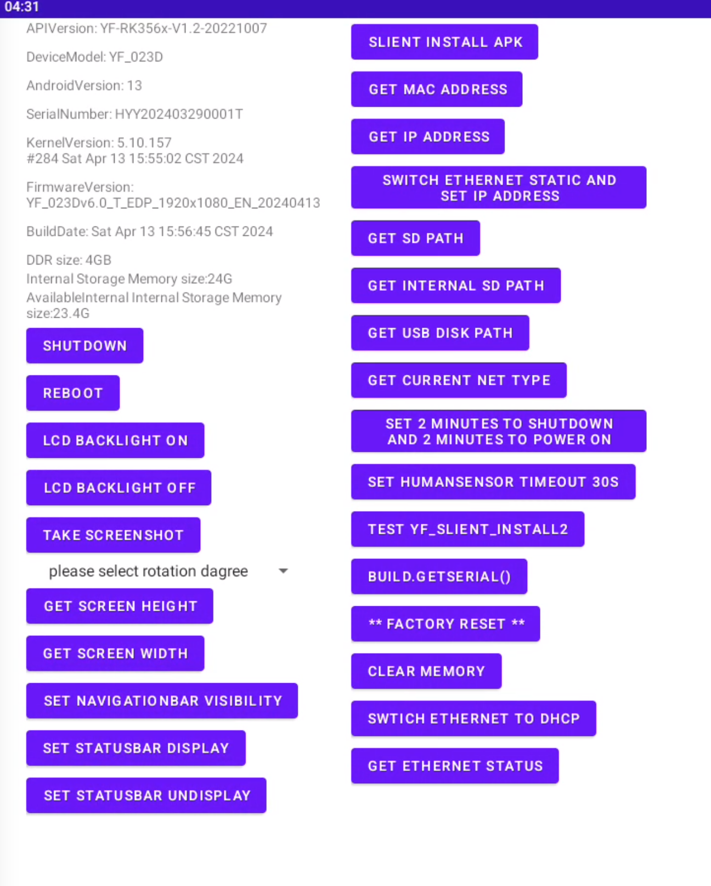

# HYY RK3566 Device Android FrameWork API Interface Development Library

## Instructions
This development library supports rapid development of FrameWork functionality for apps; No need to integrate framework. jar; No system permissions required; A few simple lines of code can enrich the functionality of your app.

 

 <table>
    <tr>
        <th>ability</th>
        <th>function</th>
    </tr>
    <tr>
        <td>DeviceModel</td>
        <td>api.yfgetAndroidDeviceModel()</td>
    </tr>
    <tr>
        <td>AndroidVersion</td>
        <td>api.yfgetAndroidVersion()</td>
    </tr>
    <tr>
        <td>SerialNumber</td>
        <td>api.yfgetSerialNumber()</td>
    </tr>
    <tr>
        <td>KernelVersion</td>
        <td>api.yfgetKernelVersion()</td>
    </tr>
    <tr>
        <td>FirmwareVersion</td>
        <td>api.yfgetFirmwareVersion()</td>
    </tr>
    <tr>
        <td>BuildDate</td>
        <td>api.yfgetBuildDate()</td>
    </tr>
    <tr>
        <td>DDR size</td>
        <td>api.yfgetRAMSize()</td>
    </tr>
    <tr>
        <td>Internal Storage Memory size</td>
        <td>api.yfgetInternalStorageMemory()</td>
    </tr>
    <tr>
        <td>AvailableInternal Internal Storage Memory size</td>
        <td>api.yfgetAvailableInternalMemorySize()</td>
    </tr>
    <tr>
        <td>shutdown</td>
        <td>api.yfShutDown()</td>
    </tr>
    <tr>
        <td>reboot</td>
        <td>api.yfReboot()</td>
    </tr>
    <tr>
        <td>lcd backlight on</td>
        <td>api.yfSetLCDOn()</td>
    </tr>
    <tr>
        <td>lcd backlight off</td>
        <td>api.yfSetLCDOff()</td>
    </tr>
    <tr>
        <td>take screenshot</td>
        <td>api.yfTakeScreenshot("/mnt/sdcard", picname)</td>
    </tr>
    <tr>
        <td>rotation</td>
        <td>api.yfsetRotation(degree)</td>
    </tr>
    <tr>
        <td>get Screen Height</td>
        <td>api.yfgetScreenHeight()</td>
    </tr>
    <tr>
        <td>get Screen Width</td>
        <td>api.yfgetScreenWidth()</td>
    </tr>
    <tr>
        <td>set NavigationBar Visibility</td>
        <td>api.yfsetNavigationBarVisibility(true)</td>
    </tr>
    <tr>
        <td>set StatusBar Display</td>
        <td>api.yfsetStatusBarDisplay(true)</td>
    </tr>
    <tr>
        <td>set StatusBar Undisplay</td>
        <td>api.yfsetStatusBarDisplay(false)</td>
    </tr>
    <tr>
        <td>slient install apk</td>
        <td>api.yfslientinstallapk(path)</td>
    </tr>
    <tr>
        <td>get mac address</td>
        <td>api.yfgetEthMacAddress()</td>
    </tr>
    <tr>
        <td>get Ip Address</td>
        <td>api.yfgetIpAddress()</td>
    </tr>
    <tr>
        <td>switch ethernet STATIC and set Ip Address</td>
        <td>api.yfsetEthIPAddress("192.168.1.125", "255.255.255.0", "192.168.1.1", "192.168.1.1")</td>
    </tr>
    <tr>
        <td>Swtich ethernet to DHCP</td>
        <td>api.yfsetEthDhcp()</td>
    </tr>
    <tr>
        <td>get ethernet status</td>
        <td>api.yfgetEthStatus()</td>
    </tr>
    <tr>
        <td>get SD Path</td>
        <td>api.yfgetSDPath()</td>
    </tr>
    <tr>
        <td>get Internal SD Path</td>
        <td>api.yfgetInternalSDPath()</td>
    </tr>
    <tr>
        <td>get USB Disk Path</td>
        <td>api.yfgetUSBPath()</td>
    </tr>
    <tr>
        <td>get Current NET TYPE</td>
        <td>api.yfgetCurrentNetType()</td>
    </tr>
    <tr>
        <td>set 2 minutes to shutdown and 2 minutes to power on</td>
        <td>Intent intent = new Intent("com.android.yf_set_timer_swtich"); 
                // { 2016, 12, 12, 17, 55 }; 
                intent.putExtra("timeon", timeonArray); 
                intent.putExtra("timeoff", timeoffArray); 
                intent.putExtra("enable", true); 
                sendBroadcast(intent);</td>
    </tr>
    <tr>
        <td>set humansensor timeout 30s</td>
        <td>api.yfsetHumanSensor(30)</td>
    </tr>
    <tr>
        <td>slient_install2</td>
        <td> Intent intent = new Intent(); 
                intent.setAction("com.android.yf_slient_install"); 
                intent.putExtra("path","/storage/emulated/0/YF_reboot.apk"); 
                intent.putExtra("isboot",true); 
                sendBroadcast(intent);</td>
    </tr>
    <tr>
        <td>** Factory Reset **</td>
        <td>Intent intent = new Intent("android.intent.action.FACTORY_RESET"); 
                intent.setPackage("android"); 
                intent.addFlags(Intent.FLAG_RECEIVER_FOREGROUND); 
                intent.putExtra("android.intent.extra.REASON", "MasterClearConfirm"); 
                intent.putExtra("android.intent.extra.WIPE_EXTERNAL_STORAGE", true); 
                intent.putExtra("com.android.internal.intent.extra.WIPE_ESIMS", true); 
                sendBroadcast(intent);</td>
    </tr>
    
 </table>